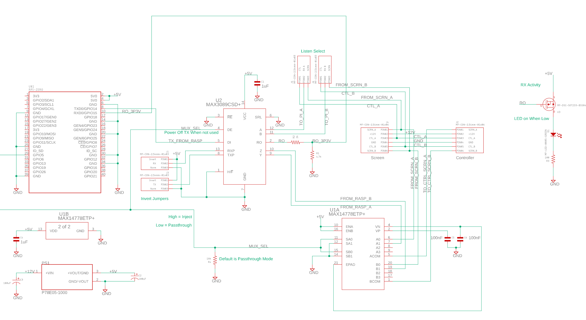

# spacontrol
IoT Work for my Caldera Vacanza Hot Tub

## General Info
I have a Caldera Vacanza Hot Tub in my house and I love it, with one exception: it heats on demand.  With electric time of use (TOU) rates, I can save money if the hot tub would heat during off-peak rates.  Goal is to reverse engineer the protocol used to signal button presses.  Phase 1 is to have a cron script adjust the setpoints so that the heating occurs during off-peak hours.  Phase 2 is to reverse engineer the status screen protocol, and forward the status to a website.

## Status
I have successfully reverse engineered the button press protocol.  Playing the protocol back proved to be tricky, as the keypad seems to be polled, so even when no buttons are pressed, the keypad reports status every ~40ms.  Injecting commands on top of the polled screen traffic does not result in the controller registering a button press. I suspect there is a switch "debouncing" algorithm that only registers a press if button polls several times in a row.  This necessitated a more complicated hardware design, where a GPIO on the raspberry pi is used to switch a mux, muting the traffic from the screen while virtual button presses are generated.

I designed a raspberry Pi Zero "hat" PCB (see the PCB directory) that uses a MAX14778 MUX to inject commands (using a MAX3089 to translate the Pi's serial port to the spa's RS-422), defaulting to a passthrough mode where the normal screen traffic is unaffected, selected via GPIO5.  I also threw in a 12V to 5V regulator to power the raspberry Pi from the 12V screen supply.  (Watch out the Vacanza controller will power cycle this 12V if valid commands are not returned for a couple of seconds or so!  That threw my debugging through a loop!)

