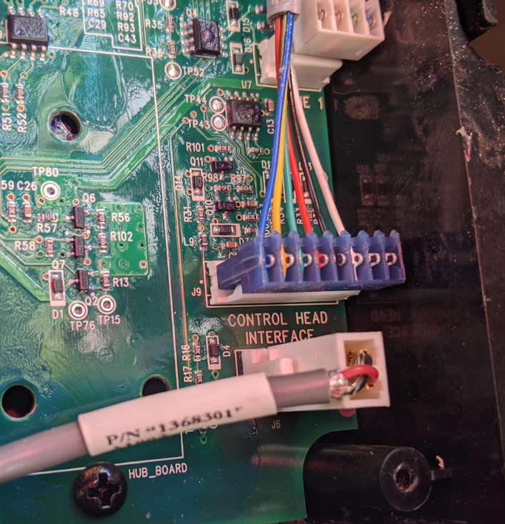
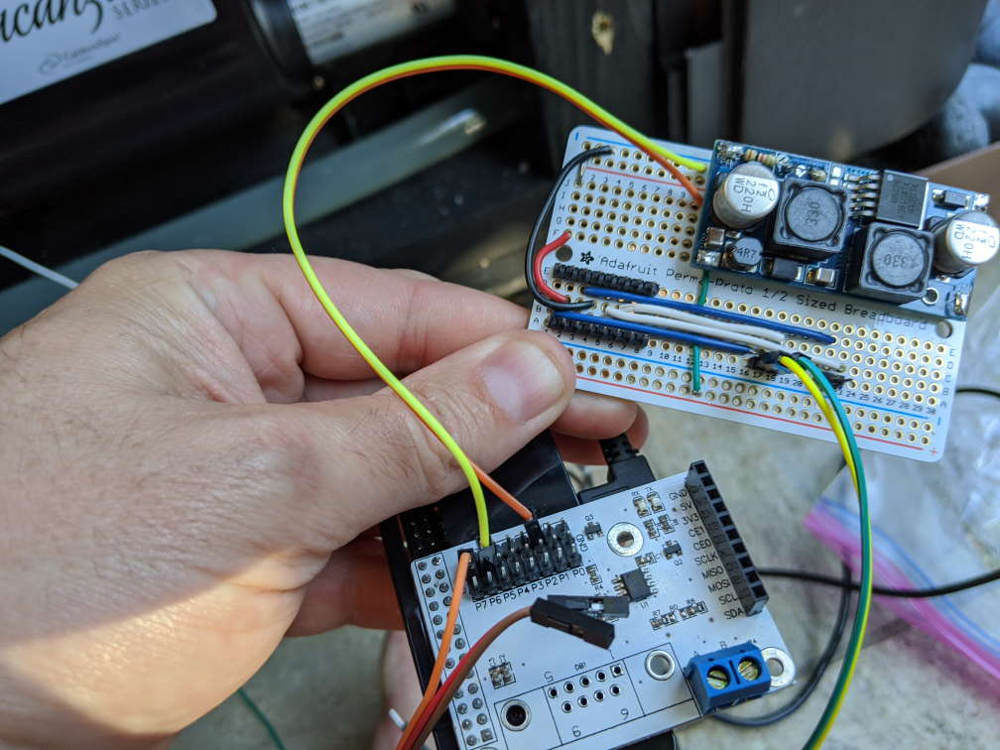
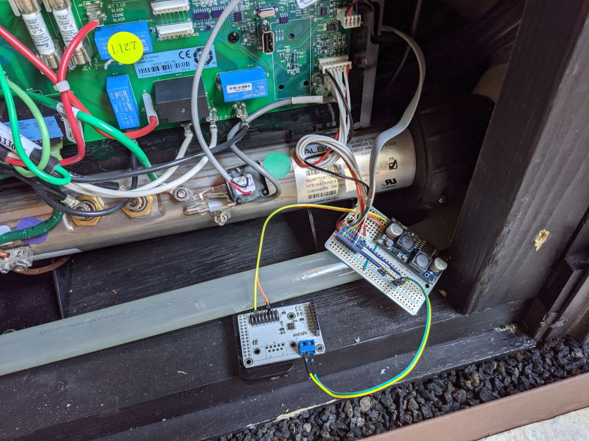
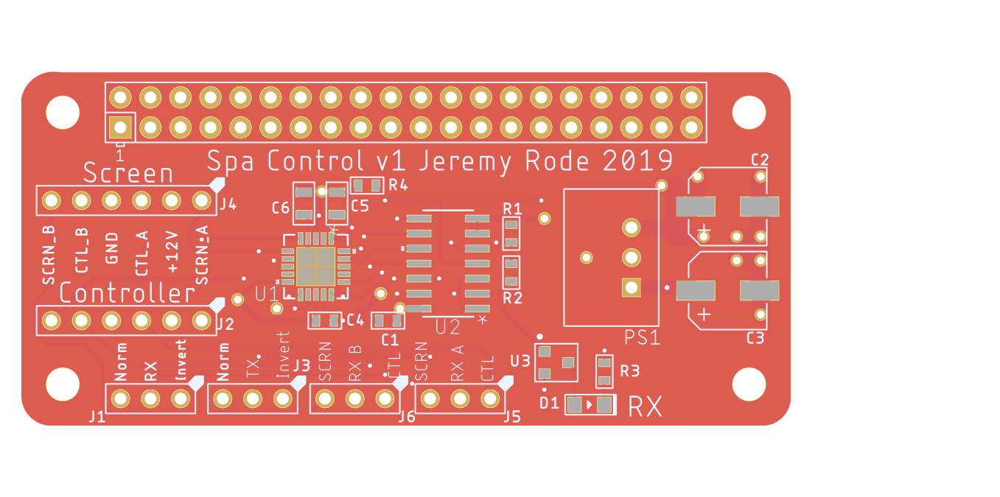

# spacontrol
IoT Work for my Caldera Vacanza Hot Tub

## General Info
I have a Caldera Vacanza Hot Tub in my house and I love it, with one exception: it heats on demand.  With electric time of use (TOU) rates, I can save money if the hot tub would heat during off-peak rates.  Goal is to reverse engineer the protocol used to signal button presses.  Phase 1 is to have a cron script adjust the setpoints so that the heating occurs during off-peak hours.  Phase 2 is to reverse engineer the status screen protocol, and forward the status to a website.

## Status

Current work is pulling temp events from a Google Calendar via the API, then schedule them.  See [googlecalendardaemon](/googlecalendardaemon)

Temp up/down works.  I have a cron job running tools/temp_up.js and tools/temp_down.js at the appropriate times for cheap TOU power.

Add the following to the crontab:
```
08 0 * * * /home/pi/spacontrol/tools/temp_down.js
10 0 * * * /home/pi/spacontrol/tools/temp_up.js
50 5 * * * /home/pi/spacontrol/tools/temp_down.js
```
Here at 12:08 AM the temp is turned down to ensure a start from 80 deg, as this code is "open-loop".  At 12:10 AM the temp is turned up to 103, then at 5:50AM the temp is turned back down to 80 deg.  Ideally the spa will be at ~100 deg in the evening when I'm ready to go in.

## Detailed Status
I have successfully reverse engineered the button press protocol.  Playing the protocol back proved to be tricky, as the keypad seems to be polled, so even when no buttons are pressed, the keypad reports status every ~40ms.  Injecting commands on top of the polled screen traffic does not result in the controller registering a button press. I suspect there is a switch "debouncing" algorithm that only registers a press if button polls several times in a row.  This necessitated a more complicated hardware design, where a GPIO on the raspberry pi is used to switch a mux, muting the traffic from the screen while virtual button presses are generated.

More details on the reverse engineering methods used, check back.

## Commands

The keypad seems to report status every ~40ms back to the controller.  I believe it is polled based off of commands sent to the pad, as the traffic seems to halt if the controller->keypad serial line is disconnected.  Baud rate is 115200, with 2-stop bits, but this doesn't seem to matter.

| Button  | Code (Hex) |
| :------:        |:----:|
| Idle            | 584D5300036b00000166 |
| Unknown / Idle  | 584D5300014b0144 |
| Jets            | 584D5300036b00100176 |
| Temp Down       | 584D5300036b0008016e |
| Temp Up         | 584D5300036b00020168 |
| Lights          | 584D5300036b00200186 |


Some how this has changed???


Now I'm seeing at idle (captured with serial_test.py):


58534d00010000f958534d00031a00830198

58534d00031a00830198

58534d00031a00830198

58534d00031a00830198

58534d00010000f958534d00031a00830198

58534d00031a00830198

58534d00031a00830198

58534d00031a0083019858534d00010000f9

58534d00031a00830198

58534d00031a00830198

58534d00031a00830198

58534d00031a0083019858534d00010000f9

58534d00031a00830198

58534d00031a00830198

58534d00031a00830198

58534d00031a0083019858534d00010000f9

58534d00031a00830198

58534d00031a00830198

58534d00031a00830198

58534d00031a0083019858534d00010000f9

58534d00031a0003011858534d00031a00030118

58534d00031a00030118

58534d00031a00030118

58534d00010000f958534d00031a00030118

58534d00031a00030118

58534d00031a00030118

58534d00031a00030118

58534d00010000f958534d00031a00030118

58534d00031a00030118

58534d00031a00030118

58534d00031a0003011858534d00010000f9

58534d00031a00030118

58534d00031a00030118

58534d00031a00030118

58534d00031a0003011858534d00010000f9

58534d00031a00030118

58534d00031a00030118

58534d00031a00030118

58534d00031a0003011858534d00010000f9

58534d00031a00830198

58534d00031a00830198

58534d00031a00830198

58534d00031a0083019858534d00010000f9

58534d00031a00830198

58534d00031a0083019858534d00031a00830198

58534d00031a00830198

58534d00010000f958534d00031a00830198

58534d00031a00830198

58534d00031a00830198

58534d00031a00830198

58534d00010000f958534d00031a00830198

58534d00031a00830198

58534d00031a00830198

58534d00031a0083019858534d00010000f9

58534d00031a00830198

58534d00031a00830198

58534d00031a00830198

58534d00031a0083019858534d00010000f9

58534d00031a00030118

58534d00031a00030118

58534d00031a00030118

58534d00031a0003011858534d00010000f9

58534d00031a00030118

No idea!, but the old commands seem to work on the sending side!

Seems to persist.  Is the the raspberryPi or the mainboard?


## Hardware details

This is the connector we would like to inject commands into:



Probing with an oscilloscope revealed the following pinout:

| Pin #  | Function |
| :------:|:----:|
| 1 | Screen->Controller (RS-422) |
| 2 | +12V |
| 3 | Controller->Screen (RS-422) |
| 4 | GND |
| 5 | Controller->Screen (RS-422) |
| 6 | Screen->Controller (RS-422) |

I have purposely not marked the RS-422 polarity, as I want to double check.  The PCB has jumpers that toggle the MAX3089's polarity inputs, so the PCB as designed will work with either polarity.

My first hand-built prototype.  



This is basically a break-out board, with a 12V to 5V converter for convenience so that I don't have to use an extension cord with a USB power supply to power the Pi Zero.  I used the [sparkfun RS485 shield](https://www.sparkfun.com/products/retired/13706) I had laying around from my [last reverse engineering project](https://github.com/jeremyrode/elancontrol).



This prototype successfully captured screen codes, and could play the codes back, but as its RS-422 transmitter is in parallel with the screens transmitter code playback never worked.  I suspect that because of the polled nature of the system transmitting status every 40ms, that when a button press code is injected some sort of button debouncing algorithm rejects the single button press code.  At this point I bit the bullet and I designed a raspberry Pi Zero "hat" PCB (see the PCB directory) that uses a MAX14778 MUX to inject commands (using a MAX3089 to translate the Pi's serial port to the spa's RS-422), defaulting to a passthrough mode where the normal screen traffic is unaffected, selected via GPIO5.  I also threw in a 12V to 5V regulator to power the raspberry Pi from the 12V screen supply.  Watch out the Vacanza controller will power cycle this 12V if valid commands are not returned for a couple of seconds or so!  That threw my debugging through a loop!


Trusty Macrofab (I highly recommend!) fabricated it no problem:


